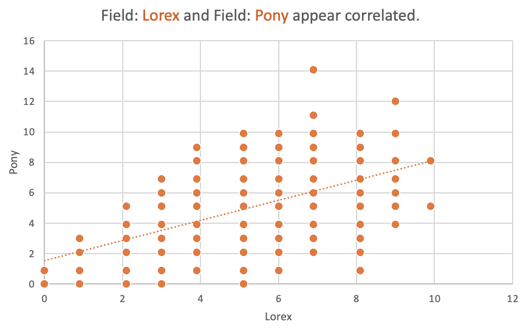
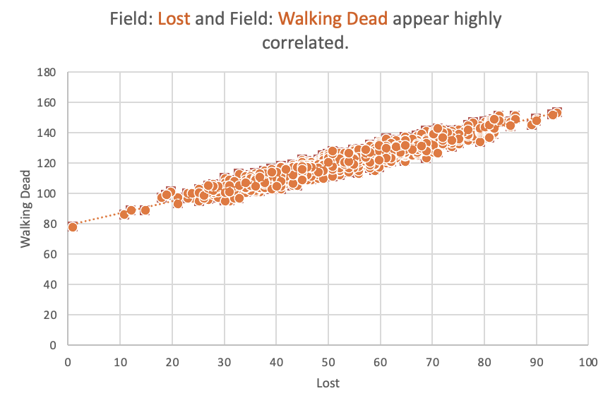
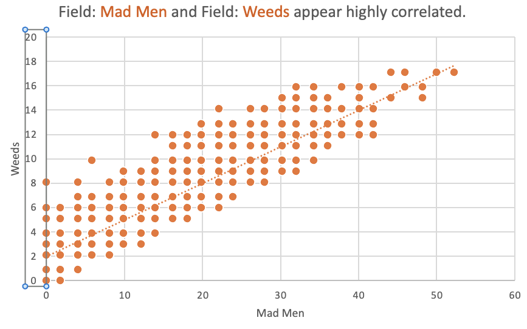

# Netflix Recommendation System Optimizer

## Overview
The Netflix Recommendation System Optimizer project aims to analyze user viewing habits and recommend shows based on their preferences. Utilizing Excel for data manipulation and analysis, this project transforms raw data into meaningful insights, allowing us to identify correlations between different shows based on user viewing behavior.
**_Disclaimer_**: _All datasets and reports do not represent any company, institution, or country but are based on a simulated dataset to demonstrate analytical capabilities using Microsoft Excel._

## Data Sources
**User Viewing Data**: The primary dataset used for this analysis includes information about the shows watched by 2,000 users, detailing the minutes spent on each show.

## Tools
- **Excel** - Data processing and visualization
- 
## Data Transformation
The data was transformed using **Pivot Tables** in Excel to calculate the total minutes spent by each user on various shows. This approach helps to quantify user engagement and provides a foundation for further analysis.

### Key Steps:
1. **Data Preparation**: Raw user viewing data was cleaned and organized.
2. **Pivot Table Creation**: A pivot table was created to summarize the total minutes each user spent watching different shows.
3. **Correlation Analysis**: By analyzing the pivot table, we examined the relationship between shows based on user overlaps.

## Shows Analyzed
The analysis focused on the following shows, with a total of **2,000 users** included in the dataset:
- **Lorax**
- **Lost**
- **Mad Men**
- **Pony**
- **Walking Dead**
- **Weeds**

  ## Problem Statement
1. How much time do users spend watching different shows?
2. Are there correlations between shows based on user viewing habits?
3. Which shows are highly recommended based on viewing behavior?

## Exploratory Data Analysis
EDA involved exploring the user viewing data to identify trends in show consumption and uncover correlations between different shows based on user preferences.

## Skills/Concepts Demonstrated
### Excel Features Utilized:
1. PivotTables
2. Conditional Formatting
3. Charts and Graphs (including scatter plots and heatmaps)
4. Formulas and Functions

### Data Analysis Tools/Techniques:
1. Correlation Analysis
2. Trend Analysis
3. User Behavior Insights

## Visualization
This project includes visualizations that highlight user engagement and show specific correlations between different shows based on user viewing habits:

1. **Lorax vs. Pony** 
   - This scatter plot shows that **57%** of users who watched **Lorax** (out of 2000 users) also viewed **Pony**. The correlation coefficient is **0.57**, indicating a moderate positive relationship. This suggests that users who enjoy **Lorax** are likely to appreciate **Pony**.

2. **Lost vs. Walking Dead** 
   - The visualization reveals that **95%** of users who watched **Lost** also watched **Walking Dead**. The correlation coefficient is **0.95**, indicating a very strong positive correlation. This highlights a significant overlap in audience between these two shows.

3. **Mad Men vs. Weeds** 
   - This graph indicates that **90%** of users who enjoyed **Mad Men** also watched **Weeds**. The correlation coefficient is **0.90**, demonstrating a strong positive relationship between the two shows. This suggests that fans of **Mad Men** are highly likely to also enjoy **Weeds**.
4. **Correlation Table**: A matrix displaying the correlation coefficients between different shows.

### Correlation Table
|            | Lorax          | Lost           | Mad Men        | Pony           | Walking Dead   | Weeds          |
|------------|----------------|----------------|----------------|----------------|----------------|----------------|
| Lorax      | 1              |                |                |                |                |                |
| Lost       | -0.0015        | 1              |                |                |                |                |
| Mad Men    | -0.0227        | -0.1290        | 1              |                |                |                |
| Pony       | **_0.5750_**         | -0.0199        | -0.0235        | 1              |                |                |
| Walking Dead| -0.0117       | **_0.9533_**         | -0.2383        | -0.0176        | 1              |                |
| Weeds      | -0.0194        | -0.1261        | **_0.9049_**         | -0.0280        | -0.2141        | 1              |

You can interact with the dashboard [here]([[https://onedrive.live.com/edit.aspx?resid=810575755AC07AA7!sf2152d39f6a64c7ab9810d4d79e45c7a&migratedtospo=true&wdorigin=OFFICECOM-WEB.START.UPLOAD&wdprevioussessionsrc=HarmonyWeb&wdprevioussession=580c85e9-e916-4f07-84db-ab34cd8274d7&wdenableroaming=1&wdodb=1&wdlcid=en-US&wdhostclicktime=1725948872043&wdredirectionreason=Force_SingleStepBoot&wdinitialsession=2c31532d-96c3-3d23-0f2a-8e925233dfd0&wdrldsc=1&wdrldc=2&wdrldr=InternalError](https://onedrive.live.com/personal/810575755ac07aa7/_layouts/15/Doc.aspx?resid=810575755AC07AA7!s94166fd74bcf42a3b7b542a7ac31b44f&cid=810575755ac07aa7&migratedtospo=true&app=Excel)](https://onedrive.live.com/personal/810575755ac07aa7/_layouts/15/doc.aspx?resid=898abaef-dd47-4e97-ad00-59930f6446c3&cid=810575755ac07aa7&ct=1727007055431&wdOrigin=OFFICECOM-WEB.START.UPLOAD&wdPreviousSessionSrc=HarmonyWeb&wdPreviousSession=6b86c522-d029-4582-b556-42b9779f31cd))

## Analysis
1. **Highly Recommended Shows**: Based on the correlation analysis, we can infer the following recommendations:
   - If people watch **Lost**, they are highly recommended to watch **Walking Dead**, and vice versa.
   - If users enjoy **Mad Men**, they should also consider watching **Weeds**, and vice versa.
   - Users who watch **Lorax** are recommended to check out **Pony**, and vice versa.

## Findings
1. The analysis identifies significant correlations between user preferences, allowing for tailored recommendations.
2. Shows like **Lost** and **Walking Dead** have a strong viewing correlation, indicating a shared audience.
3. **Mad Men** and **Weeds** are also closely linked, suggesting similar viewer interests.
4. **Lorax** and **Pony** exhibit a moderate correlation, pointing to potential viewer overlap.

## Recommendation
1. Enhance recommendation algorithms to consider these correlations for more effective user suggestions.
2. Promote related shows to users based on their viewing habits to increase engagement and retention.

## Limitations
The dataset is based on a simulated environment and may not reflect actual viewing behaviors. The analysis is intended for demonstration purposes.

## Conclusion
The insights gathered from the Netflix Recommendation System Optimizer highlight the potential for enhancing user experience through tailored recommendations. By understanding viewer preferences and correlations, Netflix can improve its recommendation algorithms, leading to increased user engagement.
